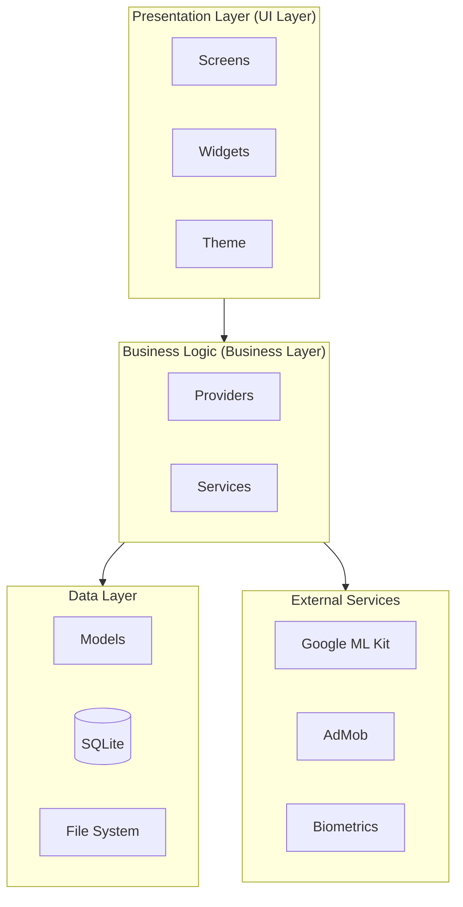
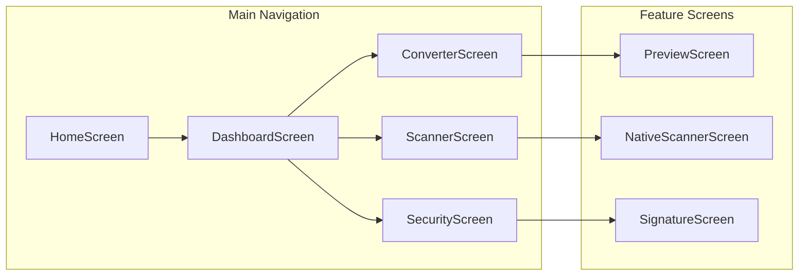
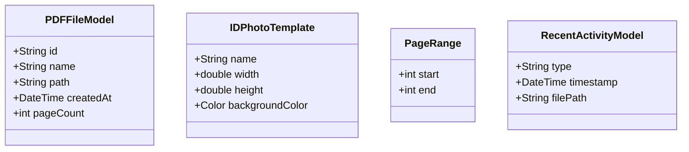
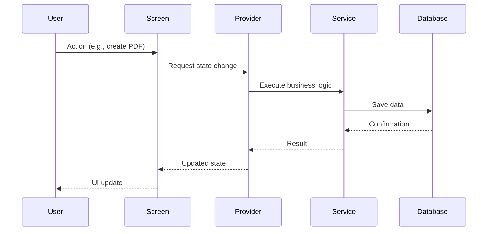
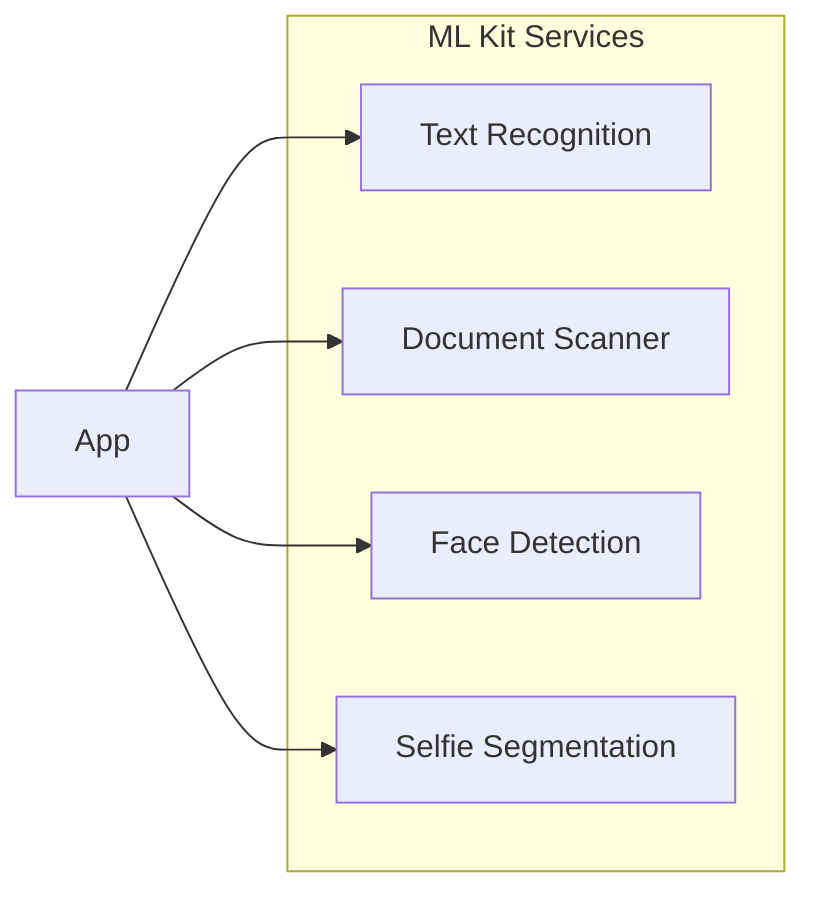
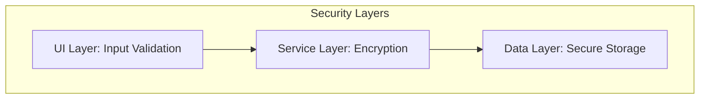

# Architecture Documentation

## Overview

PDFGen follows a clean, modular architecture based on proven software engineering principles. This documentation describes the technical structure and design decisions of the application.

---

## System Architecture



---

## Layer Architecture

### 1. Presentation Layer (UI Layer)

**Responsibility**: User interface and user interaction

| Component | Path | Description |
|-----------|------|-------------|
| Screens | `lib/screens/` | Complete screen views (23 screens) |
| Widgets | `lib/widgets/` | Reusable UI components (12 widgets) |
| Theme | `lib/theme/` | App-wide style configuration |
| Constants | `lib/constants/` | UI constants and theme definitions |

#### Screen Overview



### 2. Business Logic (Business Layer)

**Responsibility**: Application logic and state management

#### Services (14 Services)

| Service | File | Function |
|---------|------|----------|
| PDFService | `pdf_service.dart` | PDF creation and manipulation |
| PDFSecurityService | `pdf_security_service.dart` | Encryption and password protection |
| OCRService | `ocr_service.dart` | Text recognition with ML Kit |
| IDPhotoService | `id_photo_service.dart` | Passport photo generation |
| WatermarkService | `watermark_service.dart` | Watermark functions |
| BiometricService | `biometric_service.dart` | Fingerprint/Face ID |
| ImageEnhancementService | `image_enhancement_service.dart` | Image optimization |
| BookScannerService | `book_scanner_service.dart` | Book scanning with dewarping |
| BusinessCardService | `business_card_service.dart` | Business card creation |
| PDFSplitMergeService | `pdf_split_merge_service.dart` | PDF split/merge |
| AdService | `ad_service.dart` | AdMob integration |
| SubscriptionService | `subscription_service.dart` | Premium subscriptions |

#### Providers

| Provider | File | Responsibility |
|----------|------|----------------|
| PDFProvider | `pdf_provider.dart` | Central PDF state |

### 3. Data Layer

**Responsibility**: Data persistence and models

#### Data Models



#### Database

- **Technology**: SQLite via `sqflite`
- **File**: `lib/database/database_helper.dart`
- **Tables**: PDF history, settings, signatures

---

## Data Flow



---

## Design Patterns

### 1. Provider Pattern (State Management)

```dart
// Example: PDFProvider
class PDFProvider extends ChangeNotifier {
  List<PDFFileModel> _files = [];
  
  List<PDFFileModel> get files => _files;
  
  void addFile(PDFFileModel file) {
    _files.add(file);
    notifyListeners();
  }
}
```

### 2. Service Pattern

```dart
// Example: Service structure
abstract class BaseService {
  Future<void> initialize();
  Future<void> dispose();
}

class PDFSecurityService extends BaseService {
  Future<Uint8List> encryptPDF(Uint8List data, String password);
  Future<Uint8List> decryptPDF(Uint8List data, String password);
}
```

### 3. Repository Pattern (Database)

```dart
// Example: DatabaseHelper
class DatabaseHelper {
  static final DatabaseHelper instance = DatabaseHelper._init();
  static Database? _database;
  
  Future<Database> get database async {
    _database ??= await _initDB('pdfgen.db');
    return _database!;
  }
}
```

---

## External Integrations

### Google ML Kit



| Service | Package | Usage |
|---------|---------|-------|
| Text Recognition | `google_mlkit_text_recognition` | OCR extraction |
| Document Scanner | `google_mlkit_document_scanner` | Document capture |
| Face Detection | `google_mlkit_face_detection` | ID photo centering |
| Selfie Segmentation | `google_mlkit_selfie_segmentation` | Background removal |

### Biometric Authentication

- **Package**: `local_auth`
- **Supported Methods**: Fingerprint, Face ID, Iris scan
- **Usage**: Unlock password-protected PDFs

---

## Security Architecture



### Implemented Security Measures

| Measure | Implementation |
|---------|----------------|
| PDF Encryption | AES-256 via Syncfusion |
| Biometric Protection | local_auth framework |
| Secure Storage | SharedPreferences (non-sensitive), encrypted files |
| Permission Handling | permission_handler with runtime requests |

---

## Build & Deployment

### Build Configuration

```yaml
# android/app/build.gradle.kts
minSdk = 21
targetSdk = 34
compileSdk = 34
```

### Platform Support

| Platform | Status | Notes |
|----------|--------|-------|
| Android | ✅ Full | ML Kit Document Scanner (Android-only) |
| iOS | ✅ Full | VisionKit for scanning |
| Web | ⚠️ Limited | No ML Kit support |
| Windows | ⚠️ Experimental | Desktop layout |
| macOS | ⚠️ Experimental | Desktop layout |
| Linux | ⚠️ Experimental | Desktop layout |

---

## Extensibility

### Adding a New Service

1. Create service class in `lib/services/`
2. Define interface
3. Register in provider (if needed)
4. Screen integration

### Adding a New Screen

1. Create screen file in `lib/screens/`
2. Register route in navigation
3. Create widgets in `lib/widgets/` as needed
4. Implement service binding

---

## Quality Assurance

### Test Structure

```
test/
├── responsive_helper_test.dart    # Unit tests for responsive helper
└── widget_test.dart               # Widget tests
```

### Code Quality

- **Linting**: flutter_lints ^5.0.0
- **Analysis**: `flutter analyze`
- **Formatting**: `dart format`

---

*Documentation last updated: January 2026*
