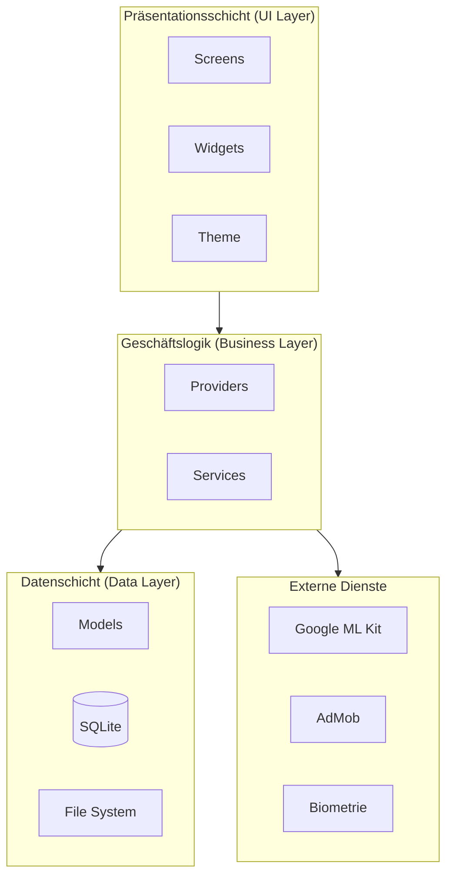
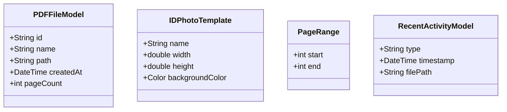
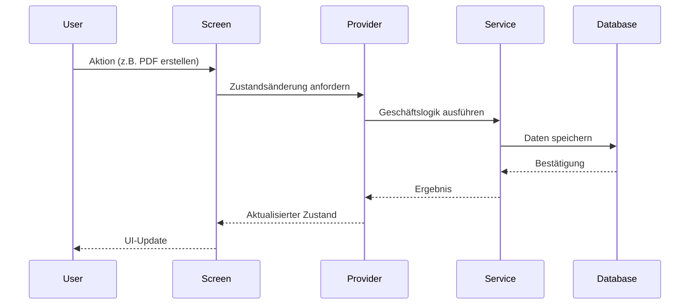
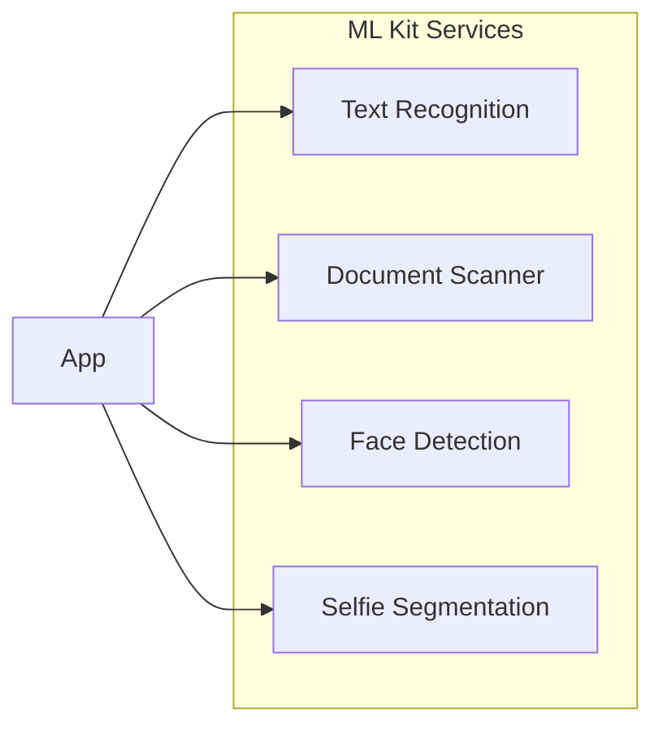
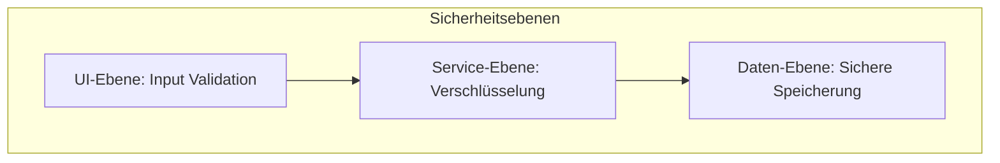

# Architektur-Dokumentation

## Übersicht

PDFGen folgt einer sauberen, modularen Architektur, die auf bewährten Software-Engineering-Prinzipien basiert. Diese Dokumentation beschreibt die technische Struktur und Designentscheidungen der Anwendung.

---

## Systemarchitektur



---

## Schichtenarchitektur

### 1. Präsentationsschicht (UI Layer)

**Verantwortung**: Benutzeroberfläche und Benutzerinteraktion

| Komponente | Pfad | Beschreibung |
|------------|------|-------------|
| Screens | `lib/screens/` | Vollständige Bildschirmansichten (23 Screens) |
| Widgets | `lib/widgets/` | Wiederverwendbare UI-Komponenten (12 Widgets) |
| Theme | `lib/theme/` | App-weite Stilkonfiguration |
| Constants | `lib/constants/` | UI-Konstanten und Theme-Definitionen |

#### Screen-Übersicht


### 2. Geschäftslogik (Business Layer)

**Verantwortung**: Anwendungslogik und Zustandsverwaltung

#### Services (14 Dienste)

| Service | Datei | Funktion |
|---------|-------|----------|
| PDFService | `pdf_service.dart` | PDF-Erstellung und -Manipulation |
| PDFSecurityService | `pdf_security_service.dart` | Verschlüsselung und Passwortschutz |
| OCRService | `ocr_service.dart` | Texterkennnung mit ML Kit |
| IDPhotoService | `id_photo_service.dart` | Passfoto-Generierung |
| WatermarkService | `watermark_service.dart` | Wasserzeichen-Funktionen |
| BiometricService | `biometric_service.dart` | Fingerabdruck/Face ID |
| ImageEnhancementService | `image_enhancement_service.dart` | Bildoptimierung |
| BookScannerService | `book_scanner_service.dart` | Buchscanning mit Entzerrung |
| BusinessCardService | `business_card_service.dart` | Visitenkarten-Erstellung |
| PDFSplitMergeService | `pdf_split_merge_service.dart` | PDF teilen/zusammenführen |
| AdService | `ad_service.dart` | AdMob-Integration |
| SubscriptionService | `subscription_service.dart` | Premium-Abonnements |

#### Providers

| Provider | Datei | Verantwortung |
|----------|-------|---------------|
| PDFProvider | `pdf_provider.dart` | Zentraler PDF-Zustand |

### 3. Datenschicht (Data Layer)

**Verantwortung**: Datenpersistenz und Modelle

#### Datenmodelle



#### Datenbank

- **Technologie**: SQLite via `sqflite`
- **Datei**: `lib/database/database_helper.dart`
- **Tabellen**: PDF-Verlauf, Einstellungen, Signaturen

---

## Datenfluss



---

## Design Patterns

### 1. Provider Pattern (State Management)

```dart
// Beispiel: PDFProvider
class PDFProvider extends ChangeNotifier {
  List<PDFFileModel> _files = [];
  
  List<PDFFileModel> get files => _files;
  
  void addFile(PDFFileModel file) {
    _files.add(file);
    notifyListeners();
  }
}
```

### 2. Service Pattern

```dart
// Beispiel: Service-Struktur
abstract class BaseService {
  Future<void> initialize();
  Future<void> dispose();
}

class PDFSecurityService extends BaseService {
  Future<Uint8List> encryptPDF(Uint8List data, String password);
  Future<Uint8List> decryptPDF(Uint8List data, String password);
}
```

### 3. Repository Pattern (Datenbank)

```dart
// Beispiel: DatabaseHelper
class DatabaseHelper {
  static final DatabaseHelper instance = DatabaseHelper._init();
  static Database? _database;
  
  Future<Database> get database async {
    _database ??= await _initDB('pdfgen.db');
    return _database!;
  }
}
```

---

## Externe Integrationen

### Google ML Kit



| Service | Package | Verwendung |
|---------|---------|-----------|
| Text Recognition | `google_mlkit_text_recognition` | OCR-Extraktion |
| Document Scanner | `google_mlkit_document_scanner` | Dokumentenerfassung |
| Face Detection | `google_mlkit_face_detection` | ID-Foto-Zentrierung |
| Selfie Segmentation | `google_mlkit_selfie_segmentation` | Hintergrundentfernung |

### Biometrische Authentifizierung

- **Package**: `local_auth`
- **Unterstützte Methoden**: Fingerabdruck, Face ID, Iris-Scan
- **Verwendung**: Entsperren passwortgeschützter PDFs

---

## Sicherheitsarchitektur



### Implementierte Sicherheitsmaßnahmen

| Maßnahme | Implementierung |
|----------|----------------|
| PDF-Verschlüsselung | AES-256 via Syncfusion |
| Biometrischer Schutz | local_auth Framework |
| Sichere Speicherung | SharedPreferences (nicht-sensitiv), verschlüsselte Dateien |
| Permission Handling | permission_handler mit Runtime-Anfragen |

---

## Build & Deployment

### Build-Konfiguration

```yaml
# android/app/build.gradle.kts
minSdk = 21
targetSdk = 34
compileSdk = 34
```

### Plattformunterstützung

| Plattform | Status | Besonderheiten |
|-----------|--------|----------------|
| Android | ✅ Vollständig | ML Kit Document Scanner (Android-only) |
| iOS | ✅ Vollständig | VisionKit für Scanning |
| Web | ⚠️ Eingeschränkt | Keine ML Kit Unterstützung |
| Windows | ⚠️ Experimentell | Desktop-Layout |
| macOS | ⚠️ Experimentell | Desktop-Layout |
| Linux | ⚠️ Experimentell | Desktop-Layout |

---

## Erweiterbarkeit

### Neuen Service hinzufügen

1. Service-Klasse in `lib/services/` erstellen
2. Interface definieren
3. In Provider registrieren (wenn nötig)
4. Screen-Integration

### Neuen Screen hinzufügen

1. Screen-Datei in `lib/screens/` erstellen
2. Route in Navigation registrieren
3. Widgets in `lib/widgets/` bei Bedarf erstellen
4. Service-Anbindung implementieren

---

## Qualitätssicherung

### Teststruktur

```
test/
├── responsive_helper_test.dart    # Unit-Tests für Responsive Helper
└── widget_test.dart               # Widget-Tests
```

### Code-Qualität

- **Linting**: flutter_lints ^5.0.0
- **Analyse**: `flutter analyze`
- **Formatierung**: `dart format`

---

*Dokumentation zuletzt aktualisiert: Januar 2026*
