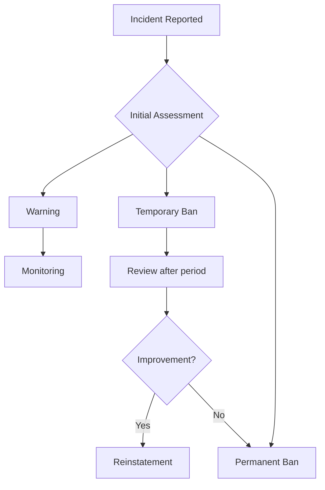

# Contributor Code of Conduct

## Our Pledge

In the interest of fostering an open and welcoming environment, we as contributors and maintainers pledge to making participation in our project and our community a harassment-free experience for everyone, regardless of age, body size, disability, ethnicity, gender identity and expression, level of experience, nationality, personal appearance, race, religion, or sexual identity and orientation.

---

## Our Standards

### ✅ Positive Behavior

Examples of behavior that contributes to creating a positive environment include:

- **Respectful Communication**: Using welcoming and inclusive language
- **Constructive Feedback**: Gracefully accepting constructive criticism
- **Community Focus**: Focusing on what is best for the community
- **Empathy**: Showing empathy towards other community members
- **Professional Collaboration**: Respecting differing viewpoints and experiences

### ❌ Unacceptable Behavior

Examples of unacceptable behavior include:

- The use of sexualized language or imagery and unwelcome sexual attention or advances
- Trolling, insulting/derogatory comments, and personal or political attacks
- Public or private harassment
- Publishing others' private information without explicit permission
- Other conduct which could reasonably be considered inappropriate in a professional setting

---

## Our Responsibilities

Project maintainers are responsible for clarifying the standards of acceptable behavior and are expected to take appropriate and fair corrective action in response to any instances of unacceptable behavior.

Project maintainers have the right and responsibility to remove, edit, or reject comments, commits, code, wiki edits, issues, and other contributions that are not aligned to this Code of Conduct, or to ban temporarily or permanently any contributor for other behaviors that they deem inappropriate, threatening, offensive, or harmful.

---

## Scope

This Code of Conduct applies both within project spaces and in public spaces when an individual is representing the project or its community.

Examples of representing a project or community include:

- Using an official project e-mail address
- Posting via an official social media account
- Acting as an appointed representative at an online or offline event

Representation of a project may be further defined and clarified by project maintainers.

---

## Enforcement

Instances of abusive, harassing, or otherwise unacceptable behavior may be reported by contacting the project team at:

📧 **[Contact via GitHub Issues with label "conduct"]**

All complaints will be reviewed and investigated and will result in a response that is deemed necessary and appropriate to the circumstances.

The project team is obligated to maintain confidentiality with regard to the reporter of an incident. Further details of specific enforcement policies may be posted separately.

Project maintainers who do not follow or enforce the Code of Conduct in good faith may face temporary or permanent repercussions as determined by other members of the project's leadership.

---

## Escalation Process

---

## Attribution

This Code of Conduct is adapted from the [Contributor Covenant](https://www.contributor-covenant.org), version 1.4, available at https://www.contributor-covenant.org/version/1/4/code-of-conduct.html

---

## Summary

| Aspect | Expectation |
|--------|-------------|
| Communication | Respectful and inclusive |
| Feedback | Constructive and objective |
| Collaboration | Professional and open |
| Conflicts | Fair and transparent resolution |

---

*Together for a positive Open Source Community* 🤝
