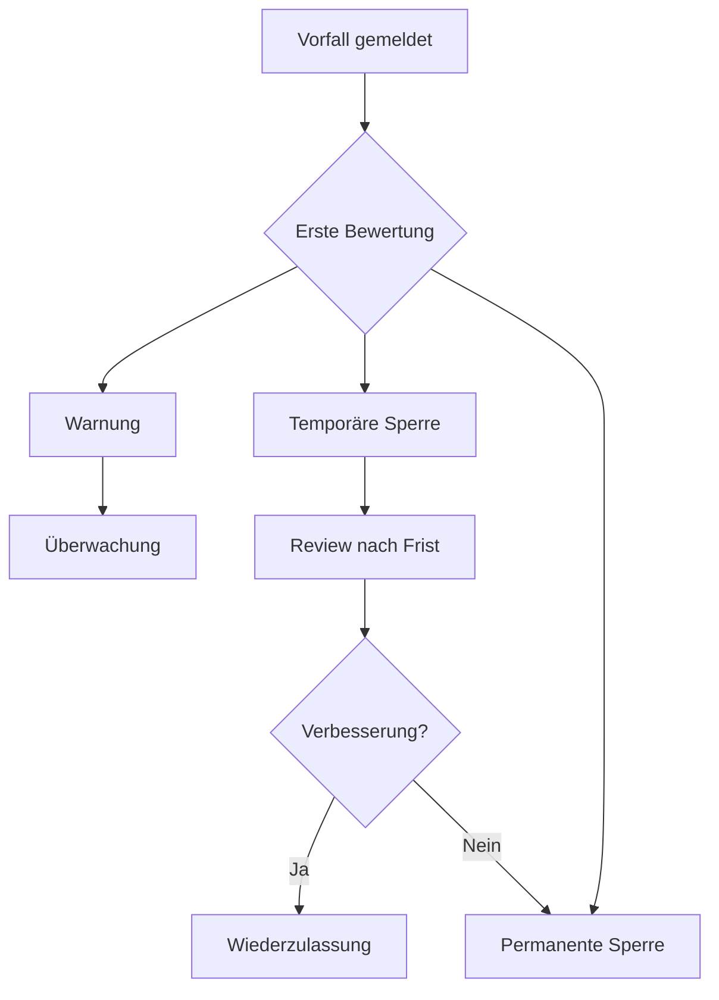

# Verhaltenskodex für Mitwirkende

## Unser Versprechen

Im Interesse einer offenen und einladenden Umgebung verpflichten wir uns als Mitwirkende und Maintainer, die Teilnahme an unserem Projekt und unserer Community zu einer belästigungsfreien Erfahrung für alle zu machen, unabhängig von Alter, Körpergröße, Behinderung, ethnischer Herkunft, Geschlechtsidentität und -ausdruck, Erfahrungsniveau, Nationalität, persönlichem Erscheinungsbild, Rasse, Religion oder sexueller Identität und Orientierung.

---

## Unsere Standards

### ✅ Positives Verhalten

Beispiele für Verhaltensweisen, die zu einer positiven Umgebung beitragen:

- **Respektvolle Kommunikation**: Verwendung einer einladenden und inklusiven Sprache
- **Konstruktives Feedback**: Respektvolle Annahme konstruktiver Kritik
- **Gemeinschaftsorientierung**: Fokus auf das, was für die Community am besten ist
- **Empathie**: Empathie gegenüber anderen Community-Mitgliedern zeigen
- **Professionelle Zusammenarbeit**: Verschiedene Standpunkte und Erfahrungen respektieren

### ❌ Inakzeptables Verhalten

Beispiele für inakzeptables Verhalten:

- Verwendung sexualisierter Sprache oder Bilder und unerwünschte sexuelle Aufmerksamkeit
- Trolling, beleidigende/abwertende Kommentare und persönliche oder politische Angriffe
- Öffentliche oder private Belästigung
- Veröffentlichung privater Informationen anderer ohne ausdrückliche Genehmigung
- Anderes Verhalten, das in einem professionellen Umfeld als unangemessen angesehen werden könnte

---

## Unsere Verantwortlichkeiten

Projektmaintainer sind verantwortlich für die Klärung der Standards für akzeptables Verhalten und werden voraussichtlich angemessene und faire Korrekturmaßnahmen als Reaktion auf alle Fälle von inakzeptablem Verhalten ergreifen.

Projektmaintainer haben das Recht und die Verantwortung, Kommentare, Commits, Code, Wiki-Bearbeitungen, Issues und andere Beiträge zu entfernen, zu bearbeiten oder abzulehnen, die nicht mit diesem Verhaltenskodex übereinstimmen, oder Mitwirkende vorübergehend oder dauerhaft für andere Verhaltensweisen zu sperren, die sie für unangemessen, bedrohlich, beleidigend oder schädlich halten.

---

## Geltungsbereich

Dieser Verhaltenskodex gilt sowohl innerhalb von Projektbereichen als auch in öffentlichen Bereichen, wenn eine Person das Projekt oder seine Community vertritt.

Beispiele für die Vertretung eines Projekts oder einer Community sind:

- Verwendung einer offiziellen Projekt-E-Mail-Adresse
- Posten über einen offiziellen Social-Media-Account
- Handeln als ernannter Vertreter bei einer Online- oder Offline-Veranstaltung

Die Vertretung eines Projekts kann von Projektmaintainern weiter definiert und klargestellt werden.

---

## Durchsetzung

Fälle von missbräuchlichem, belästigendem oder anderweitig inakzeptablem Verhalten können an das Projektteam gemeldet werden unter:

📧 **[Kontakt via GitHub Issues mit Label "conduct"]**

Alle Beschwerden werden geprüft und untersucht und führen zu einer Reaktion, die unter den gegebenen Umständen als notwendig und angemessen erachtet wird.

Das Projektteam ist verpflichtet, die Vertraulichkeit in Bezug auf den Melder eines Vorfalls zu wahren. Weitere Details zu spezifischen Durchsetzungsrichtlinien können separat veröffentlicht werden.

Projektmaintainer, die den Verhaltenskodex nicht in gutem Glauben befolgen oder durchsetzen, können vorübergehende oder dauerhafte Konsequenzen erleiden, wie sie von anderen Mitgliedern der Projektleitung bestimmt werden.

---

## Eskalationsprozess

---

## Zuordnung

Dieser Verhaltenskodex ist adaptiert vom [Contributor Covenant](https://www.contributor-covenant.org), Version 1.4, verfügbar unter https://www.contributor-covenant.org/de/version/1/4/code-of-conduct.html

---

## Zusammenfassung

| Aspekt | Erwartung |
|--------|-----------|
| Kommunikation | Respektvoll und inklusiv |
| Feedback | Konstruktiv und sachlich |
| Zusammenarbeit | Professionell und offen |
| Konflikte | Faire und transparente Lösung |

---

*Gemeinsam für eine positive Open-Source-Community* 🤝
