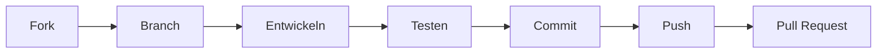

# Beitragen zu PDFGen

Vielen Dank für Ihr Interesse an der Mitarbeit an PDFGen! Dieses Dokument enthält Richtlinien und Anweisungen für Beiträge.

---

## Verhaltenskodex

Mit der Teilnahme an diesem Projekt erklären Sie sich bereit, eine respektvolle und integrative Umgebung für alle zu pflegen. Bitte lesen Sie unseren [CODE_OF_CONDUCT.md](CODE_OF_CONDUCT.md).

---

## Wie Sie beitragen können

### 🐛 Fehler melden

Bevor Sie einen Fehlerbericht erstellen, prüfen Sie bitte die bestehenden Issues, um Duplikate zu vermeiden.

**Erforderliche Informationen:**

| Feld | Beschreibung |
|------|-------------|
| Titel | Klarer, prägnanter Titel |
| Beschreibung | Detaillierte Problembeschreibung |
| Reproduktionsschritte | Nummerierte Schritte zur Reproduktion |
| Erwartetes Verhalten | Was sollte passieren? |
| Tatsächliches Verhalten | Was passiert stattdessen? |
| Screenshots | Falls zutreffend |
| Gerät/OS | Gerätemodell und Betriebssystemversion |
| App-Version | PDFGen-Version |
| Logs | Relevante Fehlerprotokolle |

**Fehlerbericht-Vorlage:**

```markdown
## Fehlerbeschreibung
[Klare Beschreibung des Fehlers]

## Reproduktionsschritte
1. Gehe zu '...'
2. Klicke auf '...'
3. Scrolle nach unten zu '...'
4. Fehler tritt auf

## Erwartetes Verhalten
[Beschreibung]

## Tatsächliches Verhalten
[Beschreibung]

## Screenshots
[Falls zutreffend]

## Umgebung
- Gerät: [z.B. Samsung Galaxy S21]
- OS: [z.B. Android 13]
- App-Version: [z.B. 1.0.0]
```

---

### 💡 Verbesserungen vorschlagen

Verbesserungsvorschläge sind willkommen! Bitte stellen Sie folgende Informationen bereit:

- **Klarer Titel und Beschreibung**
- **Anwendungsfall**: Warum wird diese Verbesserung benötigt?
- **Vorgeschlagene Lösung**: Ihre Implementierungsidee
- **Alternative Lösungen**: Welche Alternativen haben Sie in Betracht gezogen?
- **Mockups/Beispiele**: Falls zutreffend

---

### 📥 Pull Requests

#### Workflow



#### Schritt-für-Schritt

1. **Repository forken**
   ```bash
   # Über GitHub UI
   ```

2. **Repository klonen**
   ```bash
   git clone https://github.com/IHR-USERNAME/PDF-_Gen.git
   cd PDF-_Gen
   ```

3. **Feature-Branch erstellen**
   ```bash
   git checkout -b feature/meine-neue-funktion
   ```

4. **Änderungen entwickeln**
   - Halten Sie sich an die Coding-Standards (siehe unten)
   - Schreiben Sie Tests für neue Funktionen
   - Aktualisieren Sie die Dokumentation

5. **Tests ausführen**
   ```bash
   flutter test
   flutter analyze
   ```

6. **Änderungen committen**
   ```bash
   git commit -m "feat: Neue Funktion hinzugefügt"
   ```

7. **Branch pushen**
   ```bash
   git push origin feature/meine-neue-funktion
   ```

8. **Pull Request erstellen**
   - Über GitHub UI
   - Verwenden Sie die PR-Vorlage

---

## Coding-Standards

### Dart/Flutter Style Guide

Wir folgen dem [Effective Dart](https://dart.dev/guides/language/effective-dart) Style Guide.

#### Namenskonventionen

| Element | Konvention | Beispiel |
|---------|-----------|----------|
| Klassen | PascalCase | `PDFSecurityService` |
| Dateien | snake_case | `pdf_security_service.dart` |
| Variablen | camelCase | `currentPage` |
| Konstanten | lowerCamelCase | `maxPageCount` |
| Private Member | _ Prefix | `_internalState` |

#### Code-Formatierung

```bash
# Vor dem Commit ausführen
dart format lib/ test/
flutter analyze
```

#### Dokumentation

```dart
/// Kurzbeschreibung der Klasse.
///
/// Detailliertere Beschreibung, wenn nötig.
/// Kann mehrere Zeilen umfassen.
class PDFService {
  /// Erstellt ein PDF aus den gegebenen Bildern.
  ///
  /// [images] - Liste der zu konvertierenden Bilder
  /// [quality] - Bildqualität (0.0 - 1.0)
  ///
  /// Gibt das generierte PDF als [Uint8List] zurück.
  ///
  /// Throws [PDFGenerationException] wenn die Generierung fehlschlägt.
  Future<Uint8List> createPDF(List<Image> images, {double quality = 0.8}) async {
    // Implementation
  }
}
```

---

## Commit-Konventionen

Wir folgen den [Conventional Commits](https://www.conventionalcommits.org/de/) Spezifikationen.

### Format

```
<type>(<scope>): <description>

[optional body]

[optional footer]
```

### Typen

| Type | Beschreibung |
|------|-------------|
| `feat` | Neue Funktion |
| `fix` | Fehlerbehebung |
| `docs` | Nur Dokumentation |
| `style` | Formatierung, keine Codeänderung |
| `refactor` | Code-Refactoring |
| `perf` | Performance-Verbesserung |
| `test` | Tests hinzufügen/ändern |
| `chore` | Wartungsaufgaben |

### Beispiele

```bash
# Feature
git commit -m "feat(scanner): KI-gestützte Kantenerkennung hinzugefügt"

# Bugfix
git commit -m "fix(pdf): Absturz bei leerer Bildliste behoben"

# Dokumentation
git commit -m "docs: README mit Installationsanleitung aktualisiert"

# Breaking Change
git commit -m "feat(api)!: Neues Service-Interface eingeführt

BREAKING CHANGE: PDFService Interface geändert"
```

---

## Projektstruktur

```
lib/
├── constants/     # Konstanten und Konfiguration
├── database/      # Datenbankschicht
├── models/        # Datenmodelle
├── providers/     # State Management
├── screens/       # UI-Bildschirme
├── services/      # Geschäftslogik
├── utils/         # Hilfsfunktionen
└── widgets/       # Wiederverwendbare Widgets
```

### Wo gehört mein Code hin?

| Änderung | Verzeichnis |
|----------|-------------|
| Neuer Bildschirm | `lib/screens/` |
| Neue Geschäftslogik | `lib/services/` |
| Neues Datenmodell | `lib/models/` |
| Wiederverwendbares Widget | `lib/widgets/` |
| Hilfsfunktion | `lib/utils/` |

---

## Pull Request Checkliste

Bitte stellen Sie sicher, dass Ihr PR folgende Punkte erfüllt:

- [ ] Code folgt den Coding-Standards
- [ ] Alle Tests bestanden (`flutter test`)
- [ ] Keine Analyse-Warnungen (`flutter analyze`)
- [ ] Code ist formatiert (`dart format`)
- [ ] Dokumentation aktualisiert
- [ ] Commit-Nachrichten folgen Konventionen
- [ ] Changelog aktualisiert (bei Features/Bugfixes)
- [ ] Screenshots beigefügt (bei UI-Änderungen)

---

## Review-Prozess

1. **Automatische Prüfungen**
   - CI/CD Pipeline ausführen
   - Tests und Analyse

2. **Code Review**
   - Mindestens ein Reviewer erforderlich
   - Feedback adressieren

3. **Merge**
   - Squash and Merge bevorzugt
   - Branch nach Merge löschen

---

## Lizenz

Mit dem Einreichen eines Pull Requests erklären Sie sich damit einverstanden, dass Ihre Beiträge unter der MIT-Lizenz des Projekts lizenziert werden.

---

## Fragen?

Bei Fragen erstellen Sie bitte ein Issue mit dem Label `question`.

---

*Vielen Dank für Ihren Beitrag! 🇩🇪*