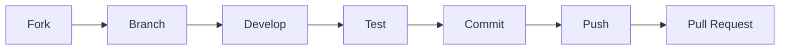

# Contributing to PDFGen

Thank you for your interest in contributing to PDFGen! This document provides guidelines and instructions for contributions.

---

## Code of Conduct

By participating in this project, you agree to maintain a respectful and inclusive environment for everyone. Please read our [CODE_OF_CONDUCT.md](CODE_OF_CONDUCT.md).

---

## How to Contribute

### 🐛 Reporting Bugs

Before creating a bug report, please check existing issues to avoid duplicates.

**Required Information:**

| Field | Description |
|-------|-------------|
| Title | Clear, concise title |
| Description | Detailed problem description |
| Reproduction Steps | Numbered steps to reproduce |
| Expected Behavior | What should happen? |
| Actual Behavior | What happens instead? |
| Screenshots | If applicable |
| Device/OS | Device model and OS version |
| App Version | PDFGen version |
| Logs | Relevant error logs |

**Bug Report Template:**

```markdown
## Bug Description
[Clear description of the bug]

## Reproduction Steps
1. Go to '...'
2. Click on '...'
3. Scroll down to '...'
4. Error occurs

## Expected Behavior
[Description]

## Actual Behavior
[Description]

## Screenshots
[If applicable]

## Environment
- Device: [e.g., Samsung Galaxy S21]
- OS: [e.g., Android 13]
- App Version: [e.g., 1.0.0]
```

---

### 💡 Suggesting Enhancements

Enhancement suggestions are welcome! Please provide the following information:

- **Clear title and description**
- **Use case**: Why is this enhancement needed?
- **Proposed solution**: Your implementation idea
- **Alternative solutions**: What alternatives have you considered?
- **Mockups/Examples**: If applicable

---

### 📥 Pull Requests

#### Workflow



#### Step-by-Step

1. **Fork the repository**
   ```bash
   # Via GitHub UI
   ```

2. **Clone the repository**
   ```bash
   git clone https://github.com/YOUR-USERNAME/PDF-_Gen.git
   cd PDF-_Gen
   ```

3. **Create a feature branch**
   ```bash
   git checkout -b feature/my-new-feature
   ```

4. **Develop your changes**
   - Follow the coding standards (see below)
   - Write tests for new features
   - Update documentation

5. **Run tests**
   ```bash
   flutter test
   flutter analyze
   ```

6. **Commit your changes**
   ```bash
   git commit -m "feat: Add new feature"
   ```

7. **Push the branch**
   ```bash
   git push origin feature/my-new-feature
   ```

8. **Create a Pull Request**
   - Via GitHub UI
   - Use the PR template

---

## Coding Standards

### Dart/Flutter Style Guide

We follow the [Effective Dart](https://dart.dev/guides/language/effective-dart) style guide.

#### Naming Conventions

| Element | Convention | Example |
|---------|-----------|---------|
| Classes | PascalCase | `PDFSecurityService` |
| Files | snake_case | `pdf_security_service.dart` |
| Variables | camelCase | `currentPage` |
| Constants | lowerCamelCase | `maxPageCount` |
| Private Members | _ Prefix | `_internalState` |

#### Code Formatting

```bash
# Run before commit
dart format lib/ test/
flutter analyze
```

#### Documentation

```dart
/// Brief description of the class.
///
/// More detailed description if needed.
/// Can span multiple lines.
class PDFService {
  /// Creates a PDF from the given images.
  ///
  /// [images] - List of images to convert
  /// [quality] - Image quality (0.0 - 1.0)
  ///
  /// Returns the generated PDF as [Uint8List].
  ///
  /// Throws [PDFGenerationException] if generation fails.
  Future<Uint8List> createPDF(List<Image> images, {double quality = 0.8}) async {
    // Implementation
  }
}
```

---

## Commit Conventions

We follow the [Conventional Commits](https://www.conventionalcommits.org/) specification.

### Format

```
<type>(<scope>): <description>

[optional body]

[optional footer]
```

### Types

| Type | Description |
|------|-------------|
| `feat` | New feature |
| `fix` | Bug fix |
| `docs` | Documentation only |
| `style` | Formatting, no code change |
| `refactor` | Code refactoring |
| `perf` | Performance improvement |
| `test` | Add/modify tests |
| `chore` | Maintenance tasks |

### Examples

```bash
# Feature
git commit -m "feat(scanner): Add AI-powered edge detection"

# Bugfix
git commit -m "fix(pdf): Fix crash with empty image list"

# Documentation
git commit -m "docs: Update README with installation guide"

# Breaking Change
git commit -m "feat(api)!: Introduce new service interface

BREAKING CHANGE: PDFService interface changed"
```

---

## Project Structure

```
lib/
├── constants/     # Constants and configuration
├── database/      # Database layer
├── models/        # Data models
├── providers/     # State management
├── screens/       # UI screens
├── services/      # Business logic
├── utils/         # Utility functions
└── widgets/       # Reusable widgets
```

### Where Does My Code Belong?

| Change | Directory |
|--------|-----------|
| New screen | `lib/screens/` |
| New business logic | `lib/services/` |
| New data model | `lib/models/` |
| Reusable widget | `lib/widgets/` |
| Utility function | `lib/utils/` |

---

## Pull Request Checklist

Please ensure your PR meets the following requirements:

- [ ] Code follows coding standards
- [ ] All tests passed (`flutter test`)
- [ ] No analysis warnings (`flutter analyze`)
- [ ] Code is formatted (`dart format`)
- [ ] Documentation updated
- [ ] Commit messages follow conventions
- [ ] Changelog updated (for features/bugfixes)
- [ ] Screenshots attached (for UI changes)

---

## Review Process

1. **Automated Checks**
   - CI/CD pipeline execution
   - Tests and analysis

2. **Code Review**
   - At least one reviewer required
   - Address feedback

3. **Merge**
   - Squash and merge preferred
   - Delete branch after merge

---

## License

By submitting a pull request, you agree that your contributions will be licensed under the Proprietary License of the project.

---

## Questions?

For questions, please create an issue with the `question` label.

---

*Thank you for your contribution! 🙏*