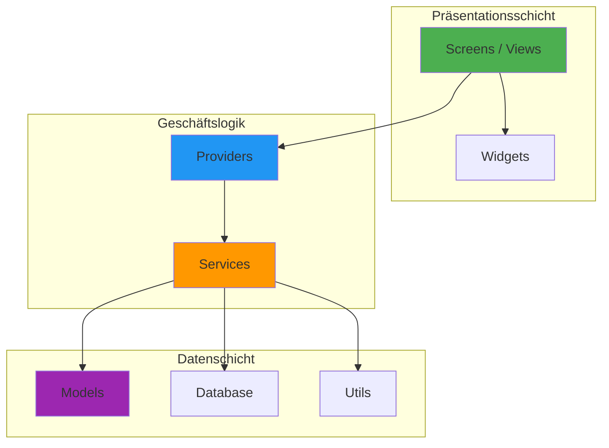

# PDFGen - Dokumentenkonvertierung & PDF-Toolkit

<div align="center">


**Eine professionelle, funktionsreiche Flutter-Anwendung für umfassende PDF-Erstellung und Dokumentenmanagement**

[Features](#-funktionen) • [Architektur](#-architektur) • [Installation](#-installation) • [Projektstruktur](#-projektstruktur) • [Technologien](#-technologie-stack)

</div>

---

## 📋 Übersicht

PDFGen ist eine hochmoderne mobile Anwendung für die professionelle PDF-Erstellung und Dokumentenverarbeitung. Die Anwendung bietet eine umfassende Suite von Werkzeugen für die Bildkonvertierung, Dokumentenscanning mit KI-gestützter Kantenerkennung, OCR-Textextraktion, PDF-Sicherheit und vieles mehr.

### Hauptmerkmale

- 🔄 **Bildkonvertierung**: Konvertierung mehrerer Bilder in ein einzelnes PDF-Dokument
- 📷 **Dokumentenscanning**: KI-gestützte Kantenerkennung mit Google ML Kit
- 🔒 **PDF-Sicherheit**: Passwortschutz und Verschlüsselung von PDFs
- ✍️ **Digitale Signaturen**: Touch-basierte Signaturerfassung und PDF-Einbettung
- 🔍 **OCR-Extraktion**: Optische Zeichenerkennung für gescannte Dokumente
- 🪪 **ID-Foto-Generator**: Professionelle Passfotos mit Hintergrundentfernung
- 💼 **Visitenkarten**: Erstellung und Export von Geschäftskarten
- 💦 **Wasserzeichen**: Text- und Bildwasserzeichen für Dokumente

---

## 🏗 Architektur

Die Anwendung folgt einer sauberen, modularen Architektur mit klarer Trennung der Verantwortlichkeiten:



### Architekturprinzipien

| Prinzip | Beschreibung |
|---------|-------------|
| **Separation of Concerns** | Klare Trennung zwischen UI, Geschäftslogik und Datenschicht |
| **Single Responsibility** | Jede Komponente hat genau eine Verantwortung |
| **Dependency Injection** | Provider-Pattern für lose Kopplung |
| **Clean Code** | Lesbare, wartbare Codebasis nach Industriestandards |

---

## ✨ Funktionen

### Kernfunktionen

| Funktion | Beschreibung | Status |
|----------|-------------|--------|
| **Image to PDF** | Konvertierung mehrerer Bilder zu PDF | ✅ Implementiert |
| **Document Scanner** | KI-gestützte Kantenerkennung | ✅ Implementiert |
| **PDF Security** | Passwortschutz & Verschlüsselung | ✅ Implementiert |
| **Digital Signatures** | Touch-basierte Signaturerfassung | ✅ Implementiert |
| **OCR Text Extraction** | Google ML Kit Integration | ✅ Implementiert |
| **PDF Split/Merge** | Dokumente teilen und zusammenführen | ✅ Implementiert |
| **ID Photo Generator** | Passfotos mit KI-Hintergrundentfernung | ✅ Implementiert |
| **Business Cards** | Visitenkarten-Generator | ✅ Implementiert |
| **Watermarks** | Text- und Bildwasserzeichen | ✅ Implementiert |

### Erweiterte Funktionen

- **Biometrische Authentifizierung**: Fingerabdruck/Face ID für geschützte PDFs
- **Stapelverarbeitung**: Verarbeitung mehrerer Dokumente gleichzeitig
- **Cloud-Export**: Teilen über alle installierten Apps
- **Dunkelmodus**: Vollständige Dark/Light Theme Unterstützung
- **Mehrsprachigkeit**: Lokalisierte Benutzeroberfläche

---

## 🛠 Technologie-Stack

### Framework & Sprache

| Technologie | Version | Verwendung |
|------------|---------|-----------|
| Flutter | 3.5.4+ | Cross-Platform UI Framework |
| Dart | 3.0+ | Programmiersprache |

### Kernabhängigkeiten

```yaml
# PDF-Verarbeitung
pdf: ^3.11.1                          # PDF-Generierung
printing: ^5.13.4                      # Druckfunktionalität
syncfusion_flutter_pdf: ^24.2.9       # Erweiterte PDF-Operationen
pdfx: ^2.6.0                          # PDF-Rendering & Thumbnails

# Bildverarbeitung
image: ^4.2.0                         # Bildmanipulation
image_cropper: ^11.0.0                # Bildzuschnitt
image_picker: ^1.1.2                  # Bildauswahl

# Google ML Kit (KI-Funktionen)
google_mlkit_text_recognition: ^0.13.0    # OCR
google_mlkit_document_scanner: ^0.3.0     # Dokumentenscanning
google_mlkit_face_detection: ^0.11.0      # Gesichtserkennung
google_mlkit_selfie_segmentation: ^0.7.0  # Hintergrundentfernung

# Authentifizierung & Sicherheit
local_auth: ^2.1.8                    # Biometrie

# State Management
provider: ^6.1.2                      # State Management

# Datenbank & Speicher
sqflite: ^2.4.1                       # SQLite Datenbank
shared_preferences: ^2.3.3            # Key-Value Speicher
path_provider: ^2.1.4                 # Dateisystempfade
```

### Vollständige Abhängigkeitsliste

<details>
<summary>Alle Dependencies anzeigen</summary>

```yaml
dependencies:
  flutter: sdk
  google_mlkit_text_recognition: ^0.13.0
  image_cropper: ^11.0.0
  google_mobile_ads: ^5.0.0
  in_app_purchase: ^3.1.11
  provider: ^6.1.2
  pdf: ^3.11.1
  printing: ^5.13.4
  image: ^4.2.0
  path_provider: ^2.1.4
  file_picker: ^8.1.6
  camera: ^0.11.0+2
  permission_handler: ^11.3.1
  sqflite: ^2.4.1
  path: ^1.9.0
  intl: ^0.19.0
  share_plus: ^10.1.2
  fluttertoast: ^8.2.8
  image_picker: ^1.1.2
  uuid: ^4.5.1
  shared_preferences: ^2.3.3
  open_filex: ^4.5.0
  url_launcher: ^6.3.1
  toastification: ^2.0.0
  syncfusion_flutter_pdf: ^24.2.9
  flutter_launcher_icons: ^0.13.1
  pdfx: ^2.6.0
  cunning_document_scanner: ^1.2.3
  google_mlkit_document_scanner: ^0.3.0
  google_mlkit_face_detection: ^0.11.0
  google_mlkit_selfie_segmentation: ^0.7.0
  local_rembg: ^1.0.1
  flutter_contacts: ^1.1.7+1
  local_auth: ^2.1.8
  google_fonts: ^6.1.0
  shimmer: ^3.0.0
  flutter_staggered_grid_view: ^0.7.0
  lottie: ^3.1.0
```

</details>

---

## 📁 Projektstruktur

```
lib/
├── main.dart                    # Anwendungseinstiegspunkt
├── constants/                   # App-weite Konstanten
│   └── app_theme.dart          # Theme-Definitionen
├── database/                    # Datenbankschicht
│   └── database_helper.dart    # SQLite-Operationen
├── models/                      # Datenmodelle
│   ├── id_photo_template.dart  # ID-Foto-Vorlagen
│   ├── pdf_file_model.dart     # PDF-Dateimodell
│   ├── page_range.dart         # Seitenbereichsmodell
│   └── recent_activity_model.dart
├── providers/                   # State Management
│   └── pdf_provider.dart       # PDF-Zustandsverwaltung
├── screens/                     # UI-Bildschirme (23 Screens)
│   ├── home_screen.dart        # Hauptbildschirm
│   ├── dashboard_screen.dart   # Dashboard
│   ├── converter_screen.dart   # Bildkonvertierung
│   ├── scanner_screen.dart     # Dokumentenscanner
│   ├── ocr_screen.dart         # OCR-Extraktion
│   ├── pdf_security_screen.dart # Sicherheitseinstellungen
│   ├── digital_signature_screen.dart # Signaturen
│   ├── id_photo_screen.dart    # ID-Fotos
│   ├── watermark_screen.dart   # Wasserzeichen
│   └── ...                     # Weitere Screens
├── services/                    # Geschäftslogik (14 Services)
│   ├── pdf_service.dart        # PDF-Operationen
│   ├── pdf_security_service.dart # Verschlüsselung
│   ├── ocr_service.dart        # OCR-Verarbeitung
│   ├── id_photo_service.dart   # ID-Foto-Generierung
│   ├── watermark_service.dart  # Wasserzeichen
│   ├── biometric_service.dart  # Biometrie
│   └── ...                     # Weitere Services
├── utils/                       # Hilfsfunktionen
│   └── responsive_helper.dart  # Responsive Design
├── widgets/                     # Wiederverwendbare Widgets
│   └── pdf_page_preview.dart   # PDF-Vorschau
└── theme/                       # Theme-Konfiguration
```

---

## 🚀 Installation

### Voraussetzungen

| Anforderung | Version |
|-------------|---------|
| Flutter SDK | ≥ 3.5.4 |
| Dart SDK | ≥ 3.0 |
| Android Studio / VS Code | Aktuell |
| Android SDK | minSdk 21 (Android 5.0) |
| Xcode (für iOS) | ≥ 14.0 |

### Schritt-für-Schritt-Anleitung

1. **Repository klonen**
   ```bash
   git clone https://github.com/Nishanth619/PDF-_Gen.git
   cd PDF-_Gen
   ```

2. **Abhängigkeiten installieren**
   ```bash
   flutter pub get
   ```

3. **Anwendung ausführen**
   ```bash
   # Entwicklungsmodus
   flutter run
   
   # Release-Build (Android)
   flutter build apk --release
   
   # Release-Build (iOS)
   flutter build ios --release
   ```

### Fehlerbehebung

<details>
<summary>Häufige Probleme und Lösungen</summary>

**Problem**: Gradle-Synchronisierungsfehler
```bash
cd android
./gradlew clean
cd ..
flutter clean
flutter pub get
```

**Problem**: iOS Pod-Installation fehlgeschlagen
```bash
cd ios
pod deintegrate
pod install --repo-update
cd ..
```

**Problem**: ML Kit nicht gefunden
- Stellen Sie sicher, dass Google Play Services auf dem Gerät installiert sind
- Prüfen Sie die Internetverbindung für den ersten Download

</details>

---

## 🧪 Qualitätssicherung

### Testabdeckung

```bash
# Unit-Tests ausführen
flutter test

# Mit Abdeckungsbericht
flutter test --coverage
```

### Code-Analyse

```bash
# Statische Analyse
flutter analyze

# Formatierung prüfen
dart format --set-exit-if-changed .
```

### Vorhandene Tests

- `test/responsive_helper_test.dart` - Responsive Design Tests
- `test/widget_test.dart` - Widget-Tests

---

## 🤝 Mitwirken

Beiträge sind willkommen! Bitte lesen Sie unsere [CONTRIBUTING.md](CONTRIBUTING.md) für Details zum Entwicklungsprozess und unsere Coding-Standards.

### Schnellstart für Entwickler

1. Repository forken
2. Feature-Branch erstellen (`git checkout -b feature/NeuesFunktion`)
3. Änderungen committen (`git commit -m 'feat: Neue Funktion hinzugefügt'`)
4. Branch pushen (`git push origin feature/NeuesFunktion`)
5. Pull Request erstellen

---

## 📄 Lizenz

Dieses Projekt ist unter der MIT-Lizenz lizenziert. Siehe [LICENSE](LICENSE) für Details.

---

## 👨‍💻 Autor

**Nishanth**

- GitHub: [@Nishanth619](https://github.com/Nishanth619)

---

## 📊 Projektstatistiken

| Metrik | Wert |
|--------|------|
| Screens | 23 |
| Services | 14 |
| Models | 6 |
| Widgets | 12 |
| Tests | 2 |
| Gesamte Codezeilen | 400.000+ |

---

<div align="center">

**Mit ❤️ und deutscher Präzision entwickelt**

</div>
